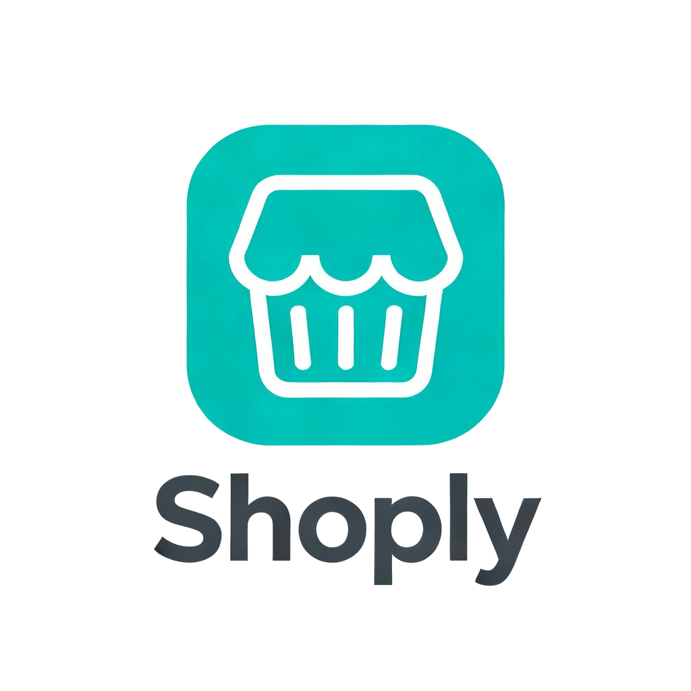

<div align="center">
  
</div>

# Shoply

---

## 🎯 Features

- **🔐 Secure Authentication** — Auth0 JWT-based authentication and authorization
- **👥 Role-Based Access Control** — Admin and user policies for endpoint protection
- **📦 RESTful API** — Clean, feature-driven architecture with CQRS pattern
- **💾 Data Persistence** — PostgreSQL database with Entity Framework Core
- **☁️ Cloud-Native** — Built with .NET Aspire for easy cloud deployment
- **📖 Interactive API Documentation** — Scalar UI for API exploration
- **💳 Stripe Integration** — Payment processing, webhooks, and refunds
- **📧 Email Notifications** — Send emails (e.g. order confirmations) with MailKit
- **⏰ Background Jobs** — Task scheduling and processing with Hangfire
- **🔗 WebHooks** — Stripe WebHooks for payment notifications
- **🔍 Pagination & Search** — Efficient pagination and product search
- **📊 OpenTelemetry** — Tracing and monitoring for distributed applications
- **🩺 Health Checks** — Standard liveness and readiness checks

---

## 📋 Requirements

- **.NET 10 SDK** — [Download](https://dotnet.microsoft.com/download/dotnet/10.0)
- **Docker Desktop** — [Download](https://www.docker.com/products/docker-desktop)
- **Auth0 Account** — [Sign up free](https://auth0.com/signup)

---

## 🚀 Getting Started

### 1. Clone Repository

```bash
git clone https://github.com/taner04/Taskly
cd Taskly
```

### 2. Configure Auth0

1. Go to [Auth0 Dashboard](https://manage.auth0.com/)
2. Create a **Single Page Web Application**
3. Create an **API** in Auth0 and set the **Identifier** (Audience)
4. Copy **Domain**, **Client ID**, **Client Secret**, and **API Audience**
5. Set the following URLs in Auth0 application settings:
    - **Allowed Callback URLs**: `https://localhost:{PORT}/scalar/v1/`
    - **Allowed Logout URLs**: `https://localhost:{PORT}/scalar/v1`

### 3. Create appsettings.json

Create `src/Shoply.WebApi/appsettings.json` with the following template:

```json
{
  "Logging": {
    "LogLevel": {
      "Default": "Information",
      "Microsoft.AspNetCore": "Warning"
    }
  },
  "AllowedHosts": "*",
  "Auth0Config": {
    "Domain": "your-auth0-domain",
    "Audience": "your-auth0-audience",
    "ClientId": "your-auth0-client-id",
    "ClientSecret": "your-auth0-client-secret",
    "UsePersistentStorage": false
  },
  "StripeConfig": {
    "PublishableKey": "your-stripe-publishable-key",
    "SecretKey": "your-stripe-secret-key",
    "SuccessUrl": "https://your-success-url",
    "CancelUrl": "https://your-cancel-url",
    "WebhookSecret": "your-stripe-webhook-secret"
  },
  "EmailConfig": {
    "Host": "localhost",
    "Port": 25
  }
}
```

### 4. Run Application

```bash
dotnet run --project ./tools/Shoply.AppHost
```

The API will be available at `https://localhost:{PORT}/scalar/v1` with interactive API documentation.

---

## 📁 Project Structure

```
Shoply/
├── docs/                        # Documentation
├── src/
│   ├── Shoply.WebApi/           # ASP.NET Core API
└── tools/
    ├── Shoply.AppHost/          # .NET Aspire orchestration
    ├── Shoply.MigrationService/ # Database migrations
    └── Shoply.ServiceDefaults/  # Shared configuration
```

## 📄 License

GNU Lesser General Public License v3.0 — see [LICENSE.md](LICENSE.md)
